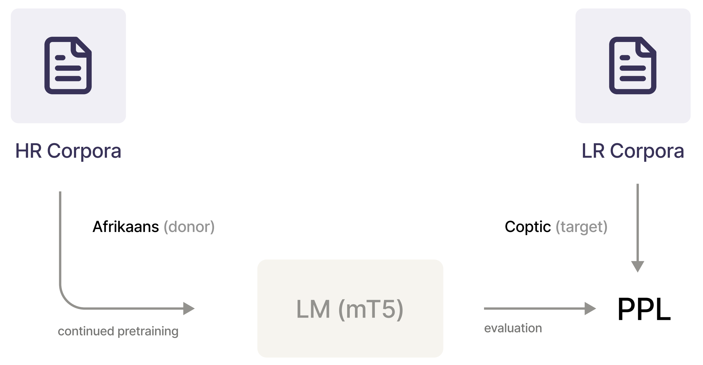

# Cross-lingual transfer between languages

This repository is dedicated to experiments on cross-lingual transfer between high-resource and low-resource languages. We primarily focus on the case of extremely low-resource languages, examining how continued pretraining on high-resource languages affects model performance on low-resource languages in the Masked Language Modeling (MLM) task setup. Our goal is to investigate the feasibility of utilizing data from high-resource languages, training on it, and observing improvements compared to zero-shot performance when evaluating on unseen low-resource languages. Additionally, we evaluate the downstream performance of cross-lingual transfer in the context of the Machine Translation task.

<p align="center">
    
</p>

## Install dependecies

```bash
pip install jax==0.3.22 jaxlib==0.3.22 -f https://storage.googleapis.com/jax-releases/jax_releases.html
pip install -r requirements.txt
```

## Pipeline of experiments

### Dataset
1. Full raw dataset is available here: [link](https://disk.yandex.ru/d/OeLH8C1F94stgw)
2. CLEAN dataset is available here: [link](https://disk.yandex.ru/d/9bSDY6NdWUT31Q)
3. See [resource_processing/](resource_processing/) for information regarding resources and scripts that were used during dataset collection:
    * [hzsk_processing](resource_processing/hzsk_processing.py)
    * [mc4_processing](resource_processing/mc4_processing.py)
    * [ud_processing](resource_processing/ud_processing.py)
    * [wiki_processing](wiki_processing/ud_processing.py)
    * [vk_hse_processing](wiki_processing/ud_processing.py)
    
### Cross-lingual transfer
1. Continued pretraining on high-resource languages: [hr_training](mt5_experiments/hr_training.py)
    ```bash
    python hr_training.py --dataset_paths "English_files/"
    ```
2. Evaluation of checkpoints on unseen low-resource languages: [lr_evaluation](mt5_experiments/lr_evaluation.py)
    ```bash
    python lr_evaluation.py --hr_lang "English"
    ```
3. Vizualization of obtained results: [notebook1](notebooks/mlm-statistic.ipynb), [notebook2](notebooks/TL%20visualization.ipynb)

### Analysis using language and data features
1. Calculation of token intersection between languages: [notebook](notebooks/Tokens%20intersection.ipynb)
2. Usage of WALS features: [notebook](notebooks/wals_feat.ipynb)

### Downstream evaluation
1. Machine translation: [link](downstream_eval/run_checkpoints_modest_wu.sh)
2. POS tagging: [notebook](notebooks/POS_final.ipynb)
